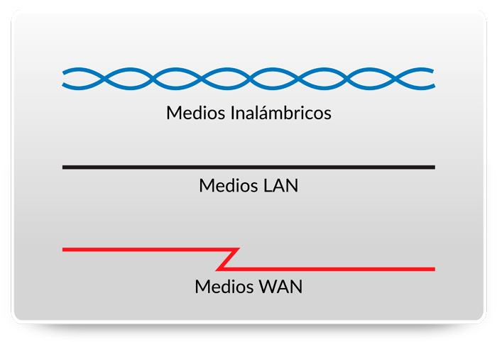
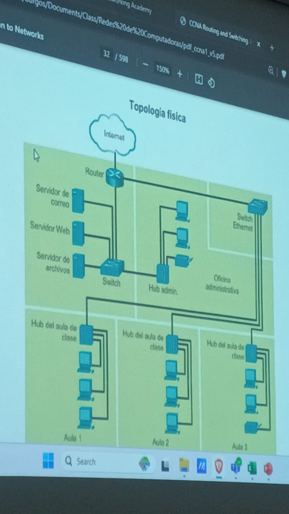
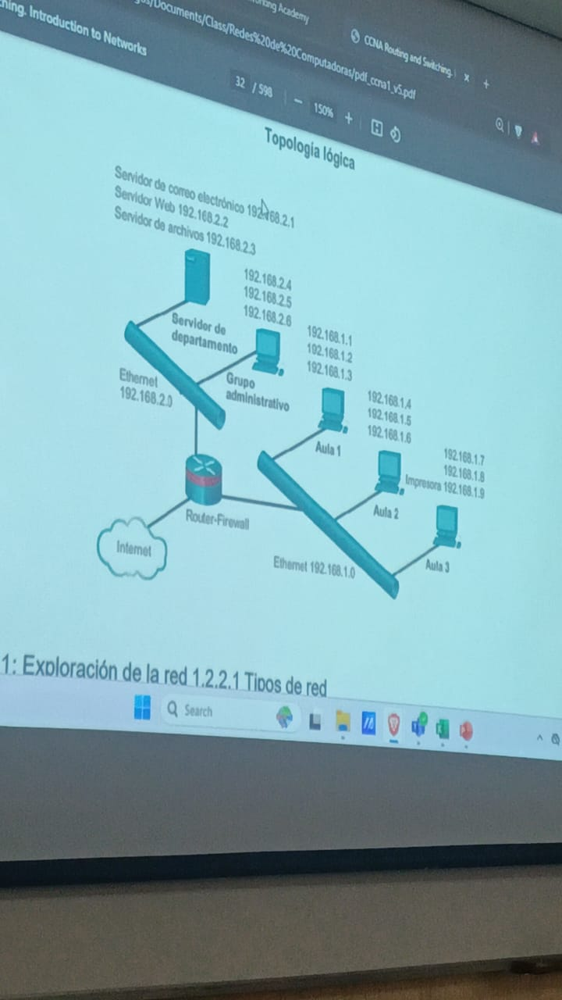

### Modulo 4.- Conexión física
Puede ser inalambrica o alambrica mediante ondas de radio.

**Routers inalambricos**
**Tarjetas de Interfaz de red (NIC)**
Podemos tener NIC Ethernet y/o NIC Wlan, esto dependiendo del dispositivo y que tan nuevo es.

Por ejemplo los dispositivos moviles no tienen una NIC Ethernet.

### Capa Física
Manejado mediante tramas en las cuales van pasando por capas donde por medio del encapsulamiento van empaquetandose en una sola unidad, comunicandose con las capas superiores u inferiores.

Pdu: Unidad de datos utilizado en el modelo Osi

### Modulo 5.- Sistemas numericos

**Direcciónes binarios e IPv4**
- 32 Bits de Longitud
- Comienzan como binarios (1 y 0) -> Se 
- Convierten a decimales

Binarias:
1000101.1010101000.1010001.10001

Notación decimal
192.168.10.10

| 64 | 32 | 16 | 8 | 4 | 2 | 1 |
| -- | -- | -- | - | - | - | - |
|    |    |    |   |   |   |   |

**Direcciónes tipo ipv6**
- 128 Bits de Longitu
- Cada 4 bits -> 1 digito exadecimal
- No distinguen entre minusculas y mayusculas

**Dirección mark**
D8-C0-A6-4E-CD-13

### Capa de Red o Osi 3
Este maneja el <u>PDU de paquetes</u>

**Direccinamiento de dispostivios fianles**
Permite intercambiar datos a través de redes a los <u>dispositivos finales</u> (Celulares, PC etc..), estos dispositivos fianles deben tener una Ip unica

- **Servidor de hcp:**
Asigna las redes a los dispositivos, estos sin dublicarlos. 

**Encapsulamiento**
Realizado por el origen donde se le agrega la ruta y el numero para saberlo idenficar, mientras que el destino lo desempaqueta

**Desencapsulación**
Salto: Mover los paquetes por varios ruters hasta llegar a destino.
El host de destino sabra que es el cuando su ip coincida con la ip de destino

### Modulo 6.- Enlace de datos Capa 2
Esta es responsable en las comunicaciones de la tardeta de interfaz de red a otra tarjeta de red

- Permite que las capas superiores accedan a los medios
- Acepta datos generalmente paquetes de Capa 3 (PV4 o IPV6) y los encapsula en tramas de Capa 2
- Controla como los datos se colcoan y reciben en los medios
- INtercambia tramas

**Nodo:** Dispositivo que puede crea, almacenar y mandar datos, este puede ser un portatil, movil o un dispositivo intermetio como un Ethernet.

Este tendria que adaptarse cada vez que se desarrolle una nueva tecnologia de red o una IP

**6.1.2 Subcapas de enclaces de datos IEEE 802 LAN/MAN**
**Control de enlace logico (LLC):** Se comunica entre el software de red de capas superiores y el hardware del dispositivo en las capas inferiores

*Asegura que la información a accesoa  datos sea correcta*

**Control de acceso a medios (Mac):**
 
Son los medios.
**802.3:** Estos son los cables, vincula el software y Hardware para mandar los datos a traves de los cables.
**802.11:** Este es wifi, mandar datos sin cables.
**802.15** El Bluethot 

Este encapsula en formato de trama por su PDU

- Delimitacion de tramas: Proporciona sincronizacion entre los nodos de transmision y de recepcion
- Direccionamiento: Se mandan forzosamente por el mismo medio
- Deteccion de errores: Operacion con bits donde se hacen operaciones en los dos lados, si existe una discrepancia significa que hay un error

**6.1.3 Provisión de acceso a los medios**
En cada salto un router utiliza las siguientes funciones
- Acepta una trama proveniente de un medio
- DEsencapsula la trama
- Vuelve a encapsular el paquete a una trama nueva
- Renvia la nueva trama adecuada al medio

**6.1.4* Estandares de la cpa de enlace de datos**
Organizaciones de ingeneria:
- IEEE
- ANSI
- ITSI
- OSI

### PDU-Capas
6.-
5.-
4.- **Segmentos**
3.- **Paquete**
2.- **Trama**
1.- 

### Modulo 8.- Encapsulación Ip 

Esto mediante la PDU de la capa de transporte y el PDU de la capa de red se encapsula la ip para ser conciderado un paquete.

**Caracteristicas de IP**
Protocolo con sobrecargsa baja.
Diseñado para rastrear ni administrar el flunjo de paquetes funciones de la capa TPC

**TCP**:
Encargado de retener la información, como cuando se descarga algo, este le dice a la Ip que vuelva a mandar la información cuando un paquete llega dañado o simplemente no llega.

- Sin conexión:
    Es como mandar datos sin notificar al destinatario.
- Menor esfuerzo
    No necestia los campos adicionales en el encabezado para mantener una conexión estableceida.

    No garantiza que todos los pauqtes que se envian se reciben (Es poco confiable).

- Medios independientes
    No puede administrar ni recuperar paquetes no recibidos o dañados.

    Puede que los paquetes lleguen dañados, no lleguen o fuera totalmente, si pasa esto el protocolo TCP se encarga de solucionar esto.
- Fobre, Fibra Optica, Conección inalambrica
    Puede transferise por cualquiera de esta

 **Destiempo**
 Esto puede ser provocado cuando no se envian por la misma ruta y uno puede llegar mas rapido que otro

Caracteristica de la red: 
**Unidad de transmisión máxima(MTU):** Es el tamaño maximo de PDU que cada medio puede transportar

**Capas de enlaces de datos**
Utilizando dirección Marck
D8-C0-A6-4E-CD-13
**OUI**: Identificador unico de organización, siendo los primeros D8-C0-A6 (Fabricante)

**Fragmentación**
Divide los paquetes Ip para viajar en medio con una MTU
No se puede fragmentar una ipv6

- **Capa Osi de transporte**
Envía segmentos para ser encapsulados en un paquete IPv4 o IPv6

### 8.2.2 Campos de encabezado de paquete ipv4

#### Repaso
**¿Que Capa Osi envia segmentos para ser encapsulados en un paquete IPv4 o Ipv6?**
Capa de transporte

**¿Que capa es reponsable de tomar un paquete Ip y preprarlo para la transmision a traves del medio de comunicación?**
Capa de enlace de datos-Subcapa Mac

**¿Cuál es el término para divir un paquete Ip al renviarlo de un medio a otro medio con una MTU mas paqueña?**
Fragmentación

**¿Cuál es el binario equivalente a la dirección Ip 192.168.11.10?**
110000.10101000.--------

**¿Que protocolo realciona una direccion MAC fija con una dirección IP de un dispositivo de destino conocido?**
ARC

#### Clase 04/02
**Tarjeta de red (NIC o adaptador Lan)**.- Proporciona la conección fisica usado por el medio que realiza la conexión a la PC

**Puerto Fisico**: Conector o una boca en un dispositivo de red

**Interfaz**: Puertos especializados en un dispositivo de internetworking que se conocetan a redes individuales

**Dispositivos Finales**: Usados por el usaurio 
- PC
- Telefono Ip
- Portaitl

**Dispositivos Intermediarios**:
- Raouter inalambrico (Modems).- Dispositivo de Capa 2
- Switch LAN
- Router
- Switch de multicapa (Switch que puede enrutar).- Dispositivo de Capa 3

**Medios de Red**:

**Diagramas de topología fisica**: Identifica la ubicación fisica de los dispositivos

**Diagramas de topologia lígica**: Identifica dispositivos, puertos y el 
esquepa de direccionamiento IP.
