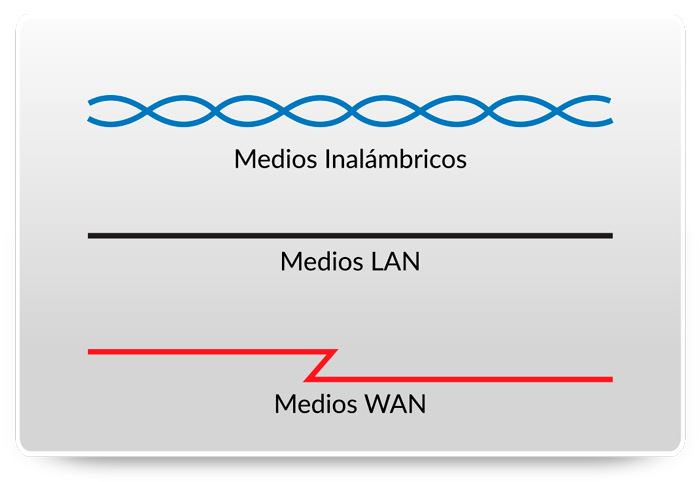
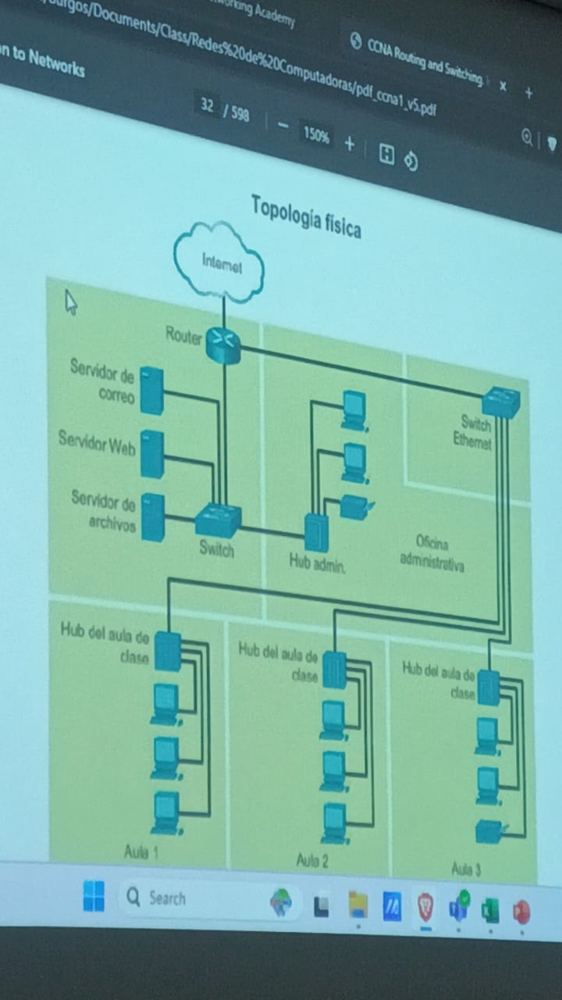
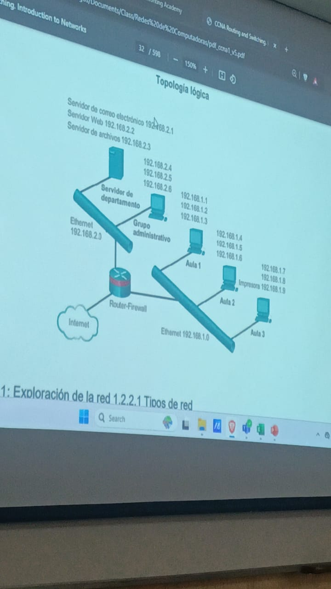
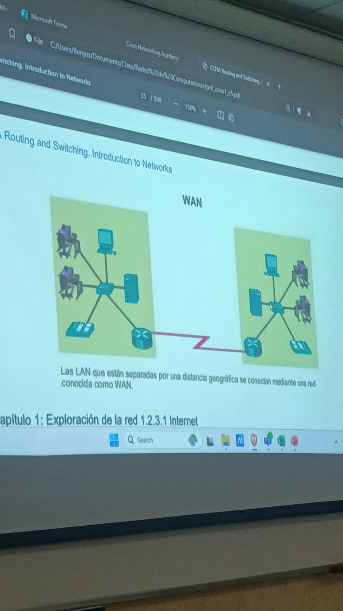
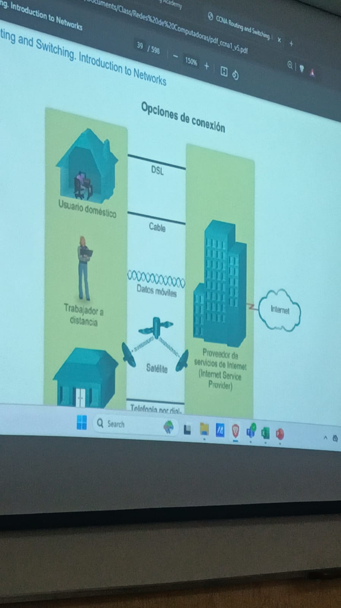

### Modulo 4.- Conexión física
Puede ser inalambrica o alambrica mediante ondas de radio.

**Routers inalambricos**
**Tarjetas de Interfaz de red (NIC)**
Podemos tener NIC Ethernet y/o NIC Wlan, esto dependiendo del dispositivo y que tan nuevo es.

Por ejemplo los dispositivos moviles no tienen una NIC Ethernet.

### Capa Física
Manejado mediante tramas en las cuales van pasando por capas donde por medio del encapsulamiento van empaquetandose en una sola unidad, comunicandose con las capas superiores u inferiores.

Pdu: Unidad de datos utilizado en el modelo Osi

### Modulo 5.- Sistemas numericos

**Direcciónes binarios e IPv4**
- 32 Bits de Longitud
- Comienzan como binarios (1 y 0) -> Se 
- Convierten a decimales

Binarias:
1000101.1010101000.1010001.10001

Notación decimal
192.168.10.10

| 64 | 32 | 16 | 8 | 4 | 2 | 1 |
| -- | -- | -- | - | - | - | - |
|    |    |    |   |   |   |   |

**Direcciónes tipo ipv6**
- 128 Bits de Longitu
- Cada 4 bits -> 1 digito exadecimal
- No distinguen entre minusculas y mayusculas

**Dirección mark**
D8-C0-A6-4E-CD-13

### Capa de Red o Osi 3
Este maneja el <u>PDU de paquetes</u>

**Direccinamiento de dispostivios fianles**
Permite intercambiar datos a través de redes a los <u>dispositivos finales</u> (Celulares, PC etc..), estos dispositivos fianles deben tener una Ip unica

- **Servidor de hcp:**
Asigna las redes a los dispositivos, estos sin dublicarlos. 

**Encapsulamiento**
Realizado por el origen donde se le agrega la ruta y el numero para saberlo idenficar, mientras que el destino lo desempaqueta

**Desencapsulación**
Salto: Mover los paquetes por varios ruters hasta llegar a destino.
El host de destino sabra que es el cuando su ip coincida con la ip de destino

### Modulo 6.- Enlace de datos Capa 2
Esta es responsable en las comunicaciones de la tardeta de interfaz de red a otra tarjeta de red

- Permite que las capas superiores accedan a los medios
- Acepta datos generalmente paquetes de Capa 3 (PV4 o IPV6) y los encapsula en tramas de Capa 2
- Controla como los datos se colcoan y reciben en los medios
- INtercambia tramas

**Nodo:** Dispositivo que puede crea, almacenar y mandar datos, este puede ser un portatil, movil o un dispositivo intermetio como un Ethernet.

Este tendria que adaptarse cada vez que se desarrolle una nueva tecnologia de red o una IP

**6.1.2 Subcapas de enclaces de datos IEEE 802 LAN/MAN**
**Control de enlace logico (LLC):** Se comunica entre el software de red de capas superiores y el hardware del dispositivo en las capas inferiores

*Asegura que la información a accesoa  datos sea correcta*

**Control de acceso a medios (Mac):**
 
Son los medios.
**802.3:** Estos son los cables, vincula el software y Hardware para mandar los datos a traves de los cables.
**802.11:** Este es wifi, mandar datos sin cables.
**802.15** El Bluethot 

Este encapsula en formato de trama por su PDU

- Delimitacion de tramas: Proporciona sincronizacion entre los nodos de transmision y de recepcion
- Direccionamiento: Se mandan forzosamente por el mismo medio
- Deteccion de errores: Operacion con bits donde se hacen operaciones en los dos lados, si existe una discrepancia significa que hay un error

**6.1.3 Provisión de acceso a los medios**
En cada salto un router utiliza las siguientes funciones
- Acepta una trama proveniente de un medio
- DEsencapsula la trama
- Vuelve a encapsular el paquete a una trama nueva
- Renvia la nueva trama adecuada al medio

**6.1.4* Estandares de la cpa de enlace de datos**
Organizaciones de ingeneria:
- IEEE
- ANSI
- ITSI
- OSI

### PDU-Capas
6.-
5.-
4.- **Segmentos**
3.- **Paquete**
2.- **Trama**
1.- 

### Modulo 8.- Encapsulación Ip 

Esto mediante la PDU de la capa de transporte y el PDU de la capa de red se encapsula la ip para ser conciderado un paquete.

**Caracteristicas de IP**
Protocolo con sobrecargsa baja.
Diseñado para rastrear ni administrar el flunjo de paquetes funciones de la capa TPC

**TCP**:
Encargado de retener la información, como cuando se descarga algo, este le dice a la Ip que vuelva a mandar la información cuando un paquete llega dañado o simplemente no llega.

- Sin conexión:
    Es como mandar datos sin notificar al destinatario.
- Menor esfuerzo
    No necestia los campos adicionales en el encabezado para mantener una conexión estableceida.

    No garantiza que todos los pauqtes que se envian se reciben (Es poco confiable).

- Medios independientes
    No puede administrar ni recuperar paquetes no recibidos o dañados.

    Puede que los paquetes lleguen dañados, no lleguen o fuera totalmente, si pasa esto el protocolo TCP se encarga de solucionar esto.
- Fobre, Fibra Optica, Conección inalambrica
    Puede transferise por cualquiera de esta

 **Destiempo**
 Esto puede ser provocado cuando no se envian por la misma ruta y uno puede llegar mas rapido que otro

Caracteristica de la red: 
**Unidad de transmisión máxima(MTU):** Es el tamaño maximo de PDU que cada medio puede transportar

**Capas de enlaces de datos**
Utilizando dirección Marck
D8-C0-A6-4E-CD-13
**OUI**: Identificador unico de organización, siendo los primeros D8-C0-A6 (Fabricante)

**Fragmentación**
Divide los paquetes Ip para viajar en medio con una MTU
No se puede fragmentar una ipv6


- **Capa Osi de transporte**
Envía segmentos para ser encapsulados en un paquete IPv4 o IPv6


### 8.2.2 Campos de encabezado de paquete ipv4


#### Repaso
**¿Que Capa Osi envia segmentos para ser encapsulados en un paquete IPv4 o Ipv6?**
Capa de transporte

**¿Que capa es reponsable de tomar un paquete Ip y preprarlo para la transmision a traves del medio de comunicación?**
Capa de enlace de datos-Subcapa Mac

**¿Cuál es el término para divir un paquete Ip al renviarlo de un medio a otro medio con una MTU mas paqueña?**
Fragmentación

**¿Cuál es el binario equivalente a la dirección Ip 192.168.11.10?**
110000.10101000.--------

**¿Que protocolo realciona una direccion MAC fija con una dirección IP de un dispositivo de destino conocido?**
ARC

#### Clase 04/02
**Tarjeta de red (NIC o adaptador Lan)**.- Proporciona la conección fisica usado por el medio que realiza la conexión a la PC

**Puerto Fisico**: Conector o una boca en un dispositivo de red

**Interfaz**: Puertos especializados en un dispositivo de internetworking que se conocetan a redes individuales

**Dispositivos Finales**: Usados por el usaurio 
- PC
- Telefono Ip
- Portaitl

**Dispositivos Intermediarios**:
- Raouter inalambrico (Modems).- Dispositivo de Capa 2
- Switch LAN
- Router
- Switch de multicapa (Switch que puede enrutar).- Dispositivo de Capa 3

**Medios de Red**:
Azul: Ondas
Negro: Cobre
Cable rojo: Conexión punto a punto (Fibra optica)


**Diagramas de topología fisica**: Identifica la ubicación fisica de los dispositivos


**Diagramas de topologia lígica**: Identifica dispositivos, puertos y el 
esquepa de direccionamiento IP.


**Red de area local**: Geograficamente pequeña (LAN)

**Red de area extensa**: Mucho mas grande (WAN), Ciudades, estados, provincias.


**Lan inalámbrica**: las LAN ilamabrcias (WLAN, Wireless LAN) Similares a las LAN solo que interconectadas de forma inalambrica a los usuarios

**Intranet**
Conección privada de redes LAN y WAN, diseñala para una organización 
- Compañia Unicamente

**Extranet**
Varias organisaciones trabajando en una red privada 
- Provedor
- Compañia 

**Conexión de usuarios remotos a Internet**
Cable: Servicio ofrecido por proveedores de servicios de telivisión por cable

**DSL**:
Conexión a internet permanente y un ancho de banda elevado, transmitida a traves de una linea telefonica, que esta dividida en tres canales.

**Datos moviles**
Red de lefonia celular.

**Satelital**
Para lugares donde estan muy lejos y no tengamos acceso a DLS o cable.

**Telefonia por dail-up**
Bajo costo que funciona con cualquier linea telefónica y modem, esta solo se deve conciderar cuando no hay otras opciones mas veloces 





### Capa de red Capa OSI 3, 05/02
- IP version 4 (IPv4) 

- **Direccionamiento de dispositivos finales:** Deben configurar con una direccion IP unica para la identificación en la red.

- **Encapsulación:** PDU de la capa de transporte en un paquete. 
al encapsular vamos de arriba hacia abajo, del 7 al 1 
Este agrega un encabezado IP

- **Enrutamiento:** Proporciona servicios para dirigir los paquetes por el mejor camino atraves de la red.
    - Salto: Pasar de un roter a otro

Un paquete tiene un tiempo de vida definido el cual nos dice cuantos saltos puede hacer

- **Desencapsulación:** El host de destino elimina el encabeazado IP del paquete, este sigue el orden del encapsulamiento pero a la inversa

1 hasta el 7

**Capa de transporte PDU4**
TSP: Seguro, se asegura que llegue sin errores.
UDP: No Seguro, no le importa si llega con errores.

### Encapsulación Ip
NAT: Relaciona una ip privada a una interfas con ip publica.

### 8.1.3 Caracteristicas de IP
IP: Protocolo de sobrecarga baja
TCP capa 4: Rastrea ni administra el flujo de paquetes

- Sin Conexión: No hay conexión con el destino establecido
    - Sin conexión-Analogía -> No requiere un intercambio de información inicial
- Mejor esfuerzo: La Ip es inherentemente poco confiable,
    - Busca la mejor forma/mas rapida de enviar los paquetes pero no asegura que todos los que se envien lleguen 
- Medios independientes: Operación independiente del medio 
    - Este no tiene información que pueda procesarse para informar al remitente si la entrega fue exitosa

**Capa Fisica OSI 1**


**Capa de enlace de datos OSI 2**
MTU: Unidad de transmición maxima, tamaño maximo del paquete


### 8.2.1 Encabezado de paquetes IPv4
Este cuenta campos para garantizar la entrega 

- **Version:** Valor que indentifica como un paquete IPv4, 0100
- **Servicios diferenciados o DiffServ (DS):** Campo que se utiliza para determinar la prioridad de cada paquete
- **Suma de comprobación de encabezado (checsum o algo asi):** Se utiliza para detectar daños en el encabezado IPv4
- **Tiempo de duración (Time to Live, TTL):**  
- **Protocolo:** Identifica para que capa va el paquete ICMP TCP UDP
- **Dirección IPv4 de origen:** Direccion unicast representa la direccion Ipv4 de origen
- **Dirección Ipv4 de destino:** Direccion unicast, multicast o difusión, representa la dirección Ipv4 de destino

#### 07/02

**IPv4:** Sin contar relleno y coxiones tiene 12 campos 
**Paquetes** se encampsulan en tramas
En un paqute **se encapsulan**: Segmentos

### 8.3.1 Limitaciones de IPv4

**Agotamiento de la dirección IPv4**

**Falta de conectividad de extermo a extremo**
NAT: Es el que guarda la entrada al paquete, NAT lleva el paquete a su destino

**Mayor complejidad de la red**
NAT crea latencia

### 8.3.2 Información general sobre IPv6

**Manejo de paquetes mejorado**
128 bits en lugar de Ipv4 con 32 bits

**Mejor manejo de paquetes**
Ipv6 se ha simplificado con menos campos

**Elimina la necesidad de NAT**
Ps no lo ocupamos

### 8.3.3 Campos de encabezado de paquete Ipv4 en el encabezado de paquete IPv6

IPv4 = **12 campos**
Ipv6 = **8 campos**

### 8.3.4 
**Versión**: valor vinario de 4 bits- 0110
**Clase de tráfico**: Equivalente al Campo de Servicios difrenciados de Ipv4 (diffServ Ipv4).
**Etiqueta de flujo**:   Todos los paquetes con la misma etiqueta rebiben el mismo tipo de manejo de routers.
**Longitud de carga util**: Indica la longitud de la porción de datos o carga util del paquete Ipv6.
**Encabezado siguiente**: Indica el tipo de contenido.
**Limiti de salto**: al llegar al 0 manda un aviso de que se llego al limite (Remplaza el tiempo de vida de IPv4)
**Dirección Ipv6 de origen**: Donde vengo.
**Dirección Ipv6 de destino**: Donde me derijo.

### 8.4
**Routers**: Trabajan en capa 3
**Itself**: un host puede hacer ping a si mismo enviando un paquete a una direccioón IPv4 especial de 127.0.0.01
**Host local**: El host de destino se encuentra en la misma red local
**Host remoto**: El host de destino se encuentra en una red remota

**Host**: Dispositivo fianl, puede establecer conexión con una misma red local, del router hacia adentro 
- computadora
- server

**En ipv4**: Origen utiliza su propia mascara de subred junto con su propia dirección Ipv4
**En ipv6**: El router local anuncia la direccion de red local 

**Gateway**: Puerta que se utiliza para salir a internet, para hacer un Host remoto
- Router o Switch de capa 3
**Lan**: Capa 2 (enlace de datos)

**Caracteristicas de un router**
- Tiene una dirección Ip local
- Puede aceptar datos en la red local
- 

### 10/02/25

### 8.5.1
**Router local:** El que nosotros usamos
**Tabla de enrutameinto:** COntiene entradas para saber donde enviar paquetes, prefijos u rutas


## Formas de Enroutar el ruter
Configurar el nombre del dispositivo

```cisco
Router(config)# hostname hostname
```


```cisco
Router(config)# line console 0
Router(config-line)# password password
Router(cinfig)
```

## 10.2.1 Configurar interfaces de routers

```cisco
GigabitEthernet 0/0/0 -> Abreviación (G0/0/0) 
GigabitEthernet 0/0/1 -> Abreviación (G0/0/1)
```
Cuando se habilita una interfaz de enrutador, se deben mostrar mensajes de información confirmando el vinculo habilitado.

**no shutdown**: 
Se activa la interfaz y es similar a darle energía. La interfaz tambien debe estar conectada a otro dispisitivo, como un switch o router  **Practicamente la prendemos**

## 10.2.3 Verificación de configuración de interfaz

Muestra todas las interfaces, sus direcciones de IP y su estado actual.
```cisco
show ip interface brief
show ipb6 interface brief
```


```Cisco
show ipo route
show ipv6 route
```

```Cisco
ip address 192.168.10.1 255.255.255.0
```

```Cisco
ipv6 address 2001:db8:acad:10::1/64
```

Lo encendemos 
```Cisco
no shutdown -> no shut
```

Regresar al modo de configuración normal
```Cisco
exit
```

## 10.3.1 Gateway predeterminado para un host
Vimos que la conección local no ocupa pasar por el router
La red reoma si ocupa pasar por el router
## 10.3.2 Gateway predeterminado para un switch
para configurar un gateway predeterminado en un switch es
```Cisco
ip default-gateway escribir ip del gateway
```


